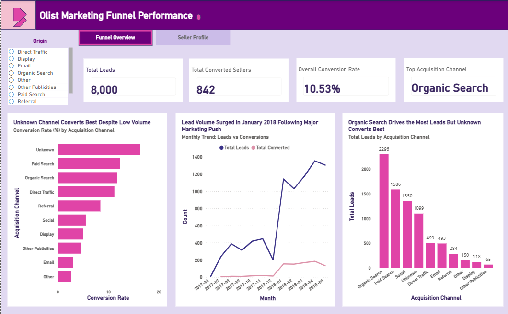
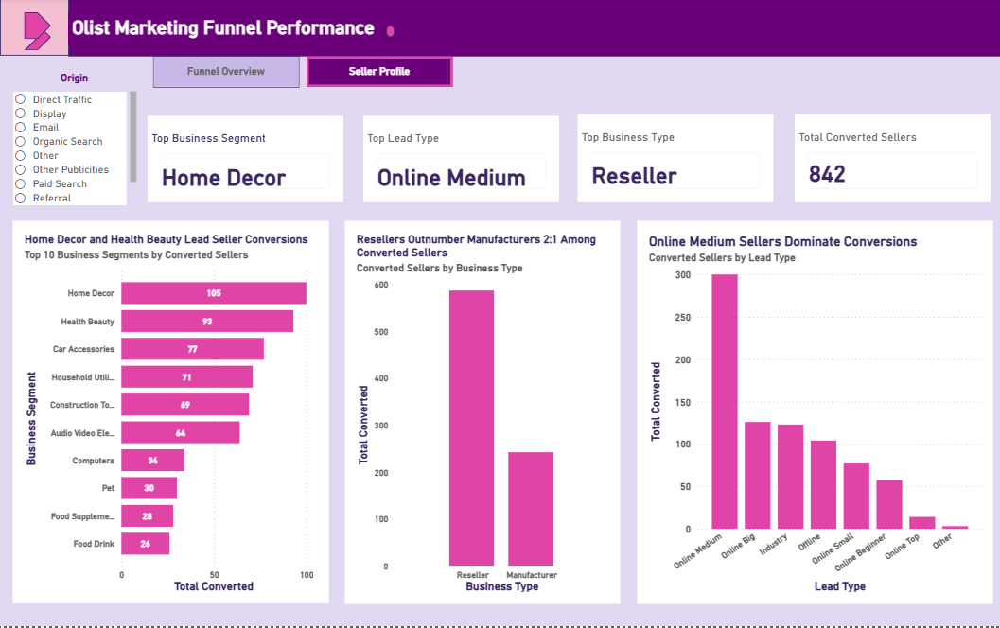

# P3 — Olist Marketing Funnel Performance
### Seller Acquisition, Conversion Analysis and Seller Profile

---

## Project Overview

This project analyses the Olist marketing funnel using real-world data covering 8,000 marketing qualified leads (MQLs) generated between June 2017 and May 2018. The goal was to understand how leads move through the funnel, which acquisition channels convert best, what types of sellers are most likely to convert, and how lead volume trended over time.

This project pairs with P2 (Brazilian E-Commerce by Olist) and extends the analysis from the customer side to the seller acquisition side of the platform.

---

## Business Questions

1. Which acquisition channel brings the most leads?
2. Which acquisition channel has the highest conversion rate?
3. Which business segment converts the most sellers?
4. How did lead volume and conversions trend month by month?
5. What lead type and business type dominate among converted sellers?

---

## KPIs

| Metric | Value |
|--------|-------|
| Total Leads | 8,000 |
| Total Converted Sellers | 842 |
| Overall Conversion Rate | 10.53% |
| Top Acquisition Channel | Organic Search |
| Top Business Segment | Home Decor |
| Top Lead Type | Online Medium |
| Top Business Type | Reseller |

---

## Tools Used

| Tool | Purpose |
|------|---------|
| Python (pandas, matplotlib, seaborn) | Exploratory data analysis and visualisation |
| Power BI | Two-page interactive dashboard |

---

## Dataset

- **Source:** [Brazilian E-Commerce Public Dataset by Olist](https://www.kaggle.com/datasets/olistbr/brazilian-ecommerce) — Kaggle
- **Tables used:**
  - `olist_marketing_qualified_leads_dataset.csv` — 8,000 leads with acquisition channel and contact date
  - `olist_closed_deals_dataset.csv` — converted sellers with business segment, lead type, and business type
- **Method:** Left join on `mql_id` to retain all 8,000 leads and flag conversions

---

## Key Findings

- **Organic Search** drives the most leads (2,296) but the **Unknown channel** converts best despite low volume
- **Paid Search** and **Organic Search** lead on conversion rate among identified channels
- **Lead volume surged in January 2018** following a major marketing push, with a peak of over 1,400 leads that month
- **Home Decor** (105) and **Health Beauty** (93) are the top converting business segments
- **Resellers outnumber Manufacturers 2:1** among converted sellers
- **Online Medium** sellers dominate conversions by lead type
- Overall conversion rate of **10.53%** across all channels and segments

---

## EDA Charts

| Chart | Description |
|-------|-------------|
| Q1 and Q2 | Total leads and conversion rate by acquisition channel |
| Q3 | Top 10 business segments by converted sellers |
| Q4 | Monthly trend of leads vs conversions (Jun 2017 to May 2018) |
| Q5 | Profile of converted sellers by lead type and business type |

---

## Dashboard Preview

### Page 1 — Funnel Overview


### Page 2 — Seller Profile


---

## File Structure

```
P3 — Olist Marketing Funnel/
├── p3_olist_marketing_funnel.ipynb        # Python EDA notebook (9 cells, 4 charts)
├── P3_Olist_Marketing_Funnel.pbix         # Two-page Power BI dashboard
├── P3_Olist_Marketing_Funnel_SCR_fixed.pptx  # 5-slide SCR presentation
├── olist_marketing_qualified_leads_dataset.csv
├── olist_closed_deals_dataset.csv
├── Images/                               # Dashboard screenshots
└── README.md
```

---

## How to Use

- Open `p3_olist_marketing_funnel.ipynb` in Jupyter Notebook to view and run the EDA
- Open `P3_Olist_Marketing_Funnel.pbix` in Power BI Desktop to explore the two-page interactive dashboard
- Open `P3_Olist_Marketing_Funnel_SCR_fixed.pptx` to view the stakeholder presentation

---

## Key Learnings

- Merging two datasets on a shared key (`mql_id`) using a left join to retain all leads
- Creating a binary conversion flag from a datetime column
- Distinguishing between lead volume and conversion rate as separate but related metrics
- Building a Month_Year calculated column in Power BI for accurate time-series visuals

---

*Project completed May 2026 as part of a structured 20-week self-directed Data Analytics programme.*  
*Tools covered: Excel | SQL | Power BI | Python*
